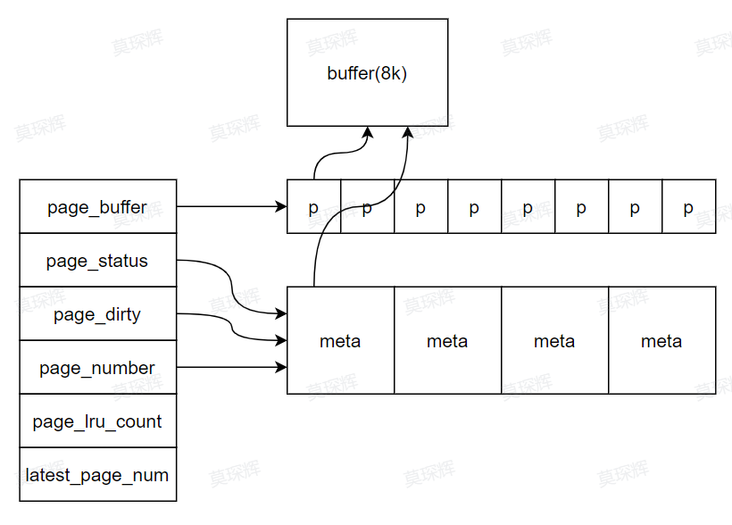

# Postgresql的缓冲区管理器

由于磁盘访问的高昂代价，因此对于常用到的数据，数据库都会引入一个内存中的缓冲区用于快速访问数据，但是系统的复杂性大大提升，缓冲区的并发控制，淘汰，检索，筛选，替换，更新，宕机恢复等都成为了一个重要的课题。

## PG的缓冲区结构

对于需要缓存的多种数据，PG使用不同的缓存策略，对于MultiXACT，CLog，CSNLog，PG使用一个简单的的LRU cache实现。见slru.cpp。主要函数有：
- SimpleLruZeroLSNs
- SimpleLruWaitIO
- SlruSelectLRUPage
- SlruPhysicalRead/WritePage
- SlruRecentlyUsed
- SlruInternalWritePage
- SlruInternalDeleteSegment

### SLRU
SLRU由一个SlruSharedData和一个SlruCtlBlock组成，其中SlruSharedData是在共享内存中的一个结构，而SlruCtlBlock则为一个非共享结构，由使用这个Slru的一个进程持有。
SlruSharedData的结构如slru.h中的代码所示，它的物理结构是使用一个长度为8的数组存储的空间的指针，每一个指针指向一个缓存的页，大小是8KB，同时为每一个页记录了：
- 页面状态 page_status。
- 页面是否为脏页 page_dirty。
- 页面对应的物理页面号 page_number。
- 页面的lru序列号 page_lru_count。
- 页面的最大物理页号 latest_page_number，置换时不应该置换这个page，因为它显然会在加载之后随时等待写入数据。

物理存储结构如图所示：

一般来说，Slru一般用作缓存CSNLog，CLog等数据，为了支持异步WAL，这些Log会被分组，一般来说，分组的策略随着日志不同而不同，一个8K的Page可以放8K*4 = 32768条事务信息，分1024个组。

#### SLRU method

Slru中有两种操作：RW，其中这些操作都会执行同样的load和store过程：如果要求的page不在缓存中，则需要从磁盘中导出，如果缓存满了，则需要把最老的page加buffer_lock并写入到磁盘中，在实际执行RW之后，还会更新lru_count，这些和我们算法题实现的lru cache如出一辙。

- SlruInit
创建一个共享内存并将它初始化，首先创建SlruSharedData结构，创建完了这些结构之后，从代码中显示出共享存储Slru元数据中指向的数组都会随着这个Slru元数据结构体创建，按顺序是：buffer, status, dirty, number, lru_count, buffer_lock等，随后初始化元数据信息和buffer_lock数组，最后初始化SlruCtlBlock。

- SimpleLruZeroPage
返回一个值均为0的page。

其他的读写操作均和普通LRU类似，因此可以通过阅读代码了解其过程，相比算法题中的LRU cache，增加的加锁解锁操作也不难理解，故不在赘述。

### Bufferpool

Bufferpool是PG数据库的主要缓存结构，通过Bufferpool，PG的表，对象的数据可以被快速访问和修改，大大减少了昂贵的磁盘IO代价。

